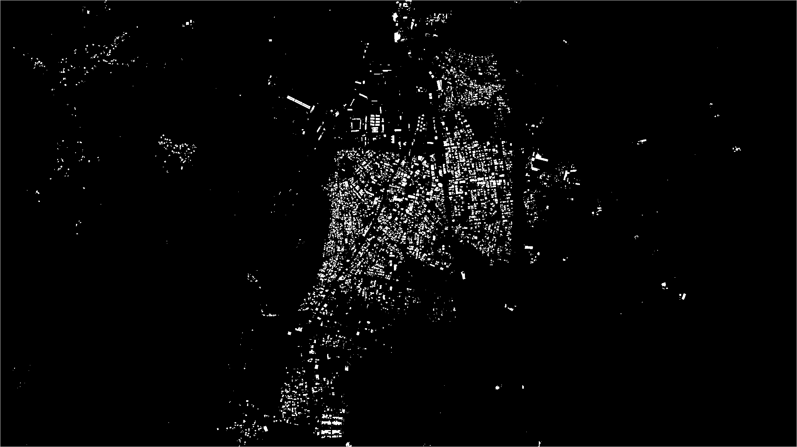
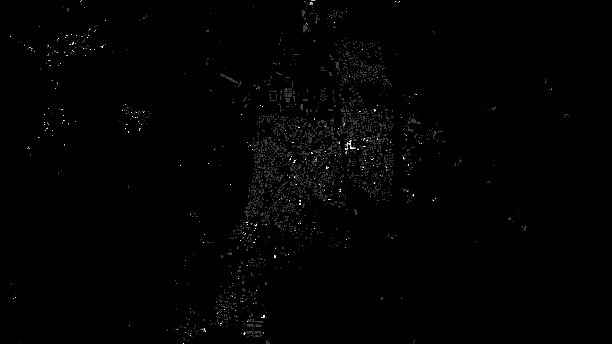

These are the components working:
### Components
1. Patch Generation (data/patches/)
2. Predictions
    1. Localization Prediction
    2. Model Prediction
    3. Destruction Classification Mask (loc*des & hot encode)
3. Overlay Generation
    1. Localization Overlay
    2. Destruction Overlay
4. UnPatch & Tiff Mapping
    1. Masks
    2. Overlays

### Setup Initialization
```
python -m venv .env
source .env/bin/activate
pip install -r requirements.txt
```
Download weights given on xview2_first_place [release](https://github.com/DIUx-xView/xView2_first_place/releases)
- Make a weights folder and place them there.
- Place your data in  `data/tiff/pre` and `data/tiff/post` containing pre and post diaster images. Both pre and post tiff should have same names.
### Inference
```
python main.py
```
### Results
<table>
  <tr>
    <td>
      <!--  -->
        
        <p align="center">Localization Mask Prediction</p>
    </td>
    <td>
      <!--  -->
  
      <p align="center">Destruction Mask Prediction</p>
    </td>
    <td>
      <!--  -->
  
      <p align="center">Destruction overlay on pre tiff file</p>
    </td>
  </tr>
</table>